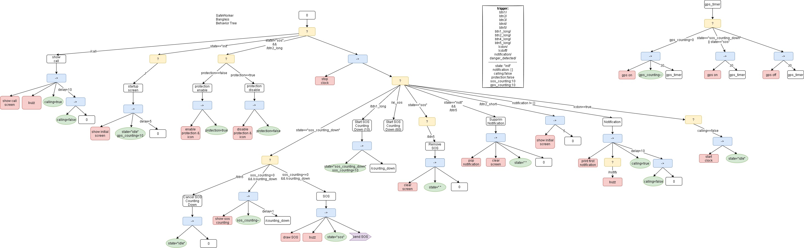

# SafeWorker
## Installation
1) Clean the watch: From https://banglejs.com/apps/ -> About -> Remove All Apps;
2) Install Widgets: From https://banglejs.com/apps/#widget , install "Battery Level Widget (with percentage)" and "Bluetooth Widget";
3) Flash the watch from https://www.espruino.com/ide/# by bootcde.js

## Manual:
1) Press Btn 1 by 3 seconds to trigger the SOS (even the screen is off);
2) Press Btn 5 to remove the SOS;
3) Press Btn 2 by 3 seconds to active (AI based) danger detection (screen must be on first);
4) Press Btn 2 again by 3 seconds to desactive danger detection.

The behavior tree is: 

